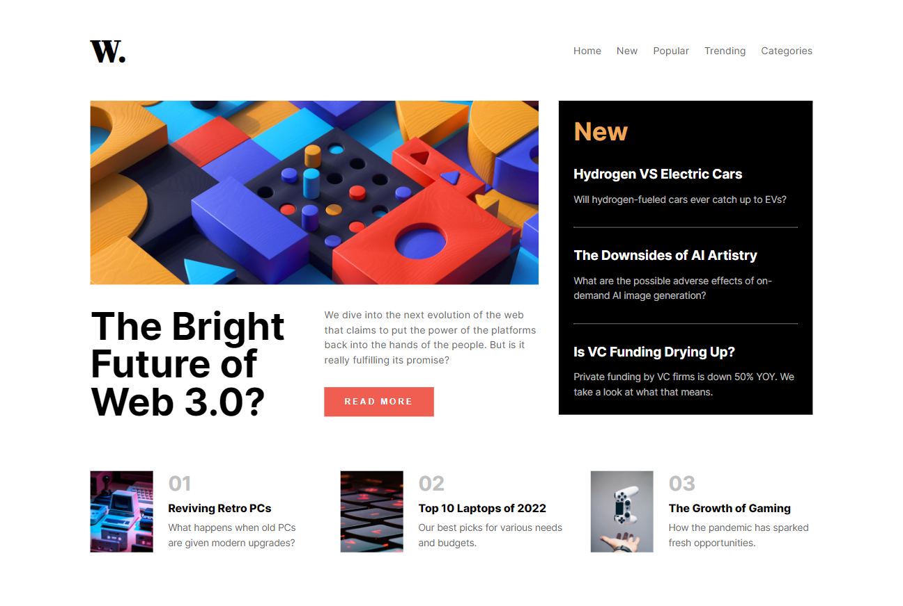
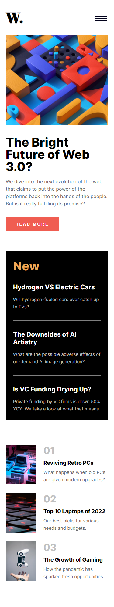
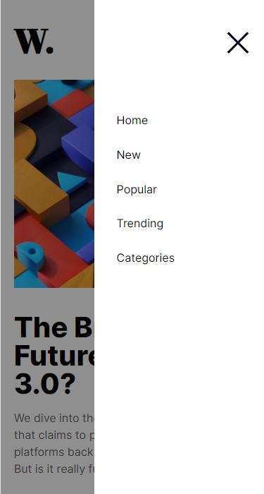

# Frontend Mentor - News homepage solution

This is a solution to the [News homepage challenge on Frontend Mentor](https://www.frontendmentor.io/challenges/news-homepage-H6SWTa1MFl).

## Table of contents

- [Overview](#overview)
  - [The challenge](#the-challenge)
  - [Screenshot](#screenshot)
  - [Links](#links)
  - [Built with](#built-with)

## Overview

### The challenge

Users should be able to:

- View the optimal layout for the interface depending on their device's screen size
- See hover and focus states for all interactive elements on the page

### Screenshot

## Desktop View

## Mobile View

## Mobile Menu

### Links

- Solution URL: [https://github.com/aashabul/news-homepage-html-sass-js](https://github.com/aashabul/news-homepage-html-sass-js)
- Live Site URL: [https://serene-melomakarona-702f33.netlify.app/](https://serene-melomakarona-702f33.netlify.app/)

### Built with

- Semantic HTML5 markup
- Flexbox
- SASS
- JavaScript
